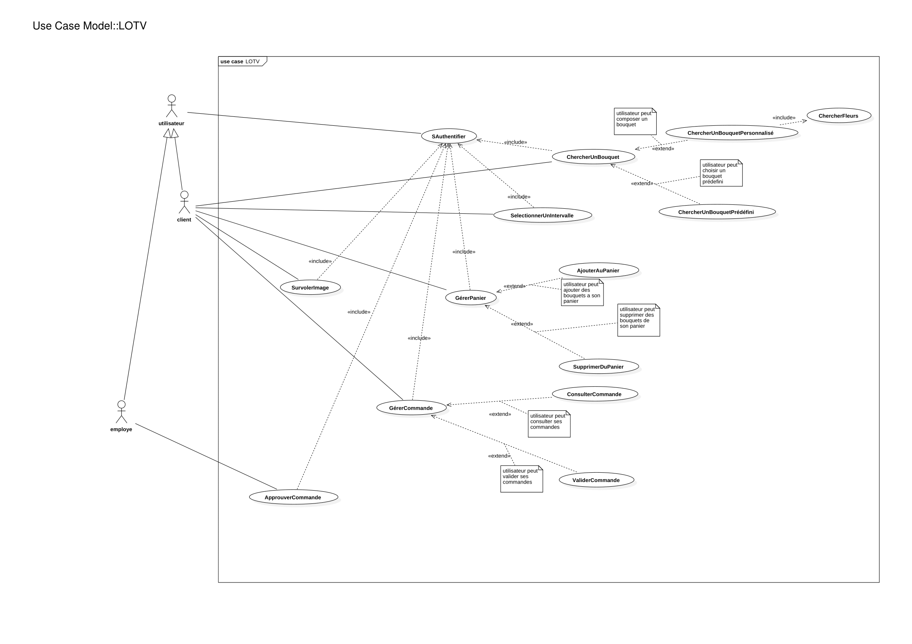
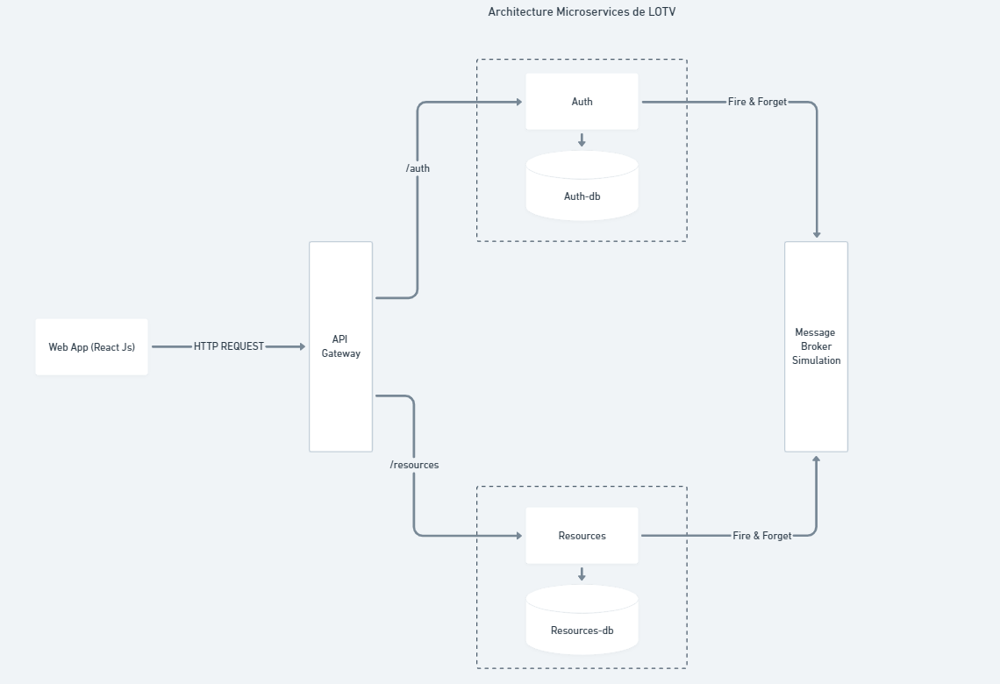
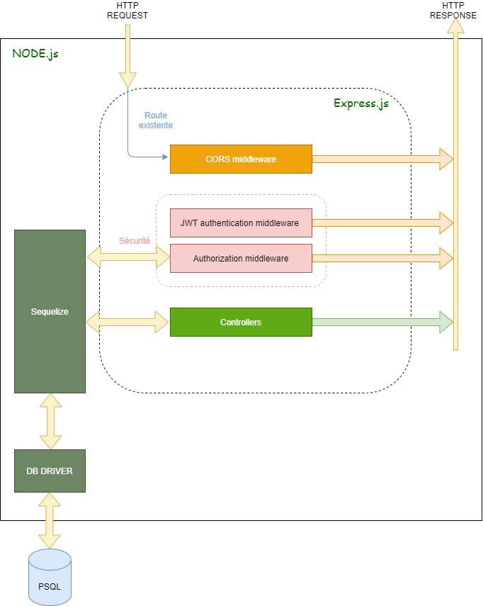
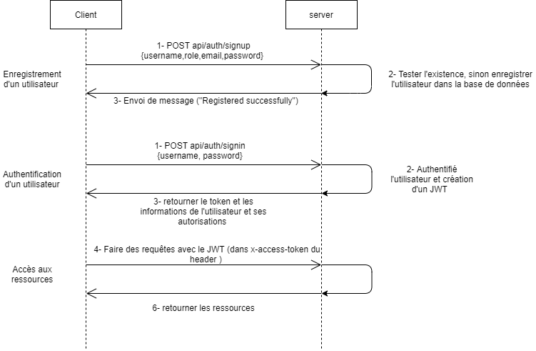
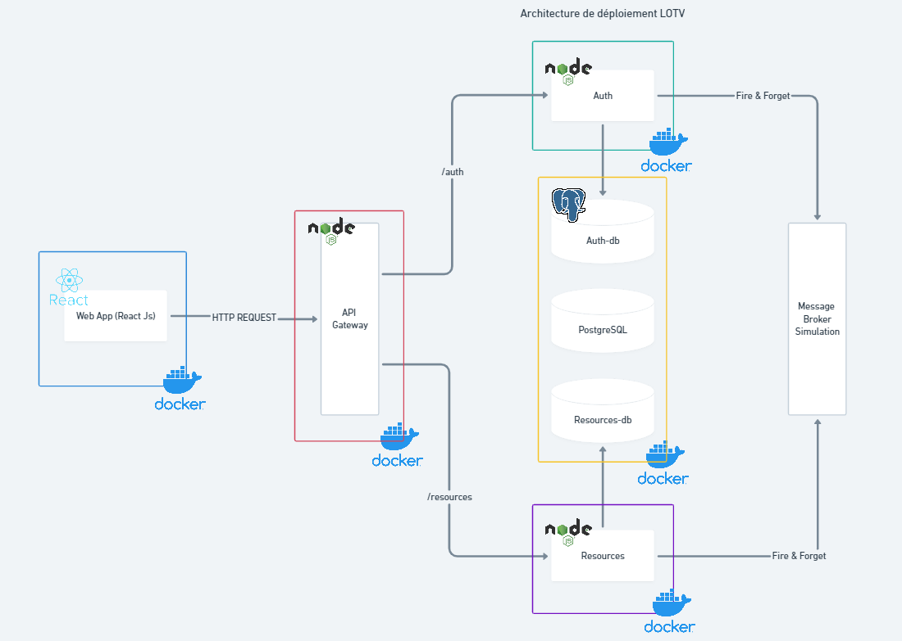

# Lily Of The Valley
Lily Of The Valley est  une application web spécialisée dans la gestion  des ventes de fleuristes . L'application propose plusieurs niveaux de privilèges (Simple utilisateurs -client- , Modérateurs -employé- et des Admins ) pour un bon fonctionnement et supervision des taches . LOTV est développé essentiellement avec Express.js coté serveur et React JS coté client , avec son interface intuitive l'utilisateur (client) peut choisir des commandes d'une manière flexible (plusieurs bouquets prédéfinis ou personnalisés) avec filtration de prix de bouquets prédéfinis  et un affichage dynamique de différents bouquets , on peut également assembler des bouquets selon son goût ( différentes fleurs fournies par la boutique) en appuyant sur l'option des bouquets personnalisés . Les modérateurs (Employés) peuvent de leurs coté valider des commandes personnalisées par les clients sous un affichage intuitive et dynamique de toutes les commandes personnalisées avec le nom de l'utilisateur et les fleurs qui composent chaque bouquets avec la quantité de chaque fleur.
## Analyse , Conception et Implémentation 
Dans ce qui suit , on va définir toutes les étapes , en détails ,  qui ont mené à la création de ce projet 
### Partie  01 : Expression de besoins
Pour avoir un très bon résultats , il faudra bien évidemment bien exprimer et cerner les besoins ( qui sont nos besoins dans ce cas ^ _ ^ , qu'on a imaginé pour réaliser le projet , vu qu'on a le choix sur la nature de l'application ) .
#### Spécification des besoins 
1. **Spécification des besoins fonctionnelles:**   

|ID|Spécification                                                                                                   |Etat     |Criticisme|Effort|Stabilité|Cible|
|--|----------------------------------------------------------------------------------------------------------------|---------|----------|------|---------|-----|
|01|Le système doit permettre au client d’accéder à une page d’accueil affichant les images des bouquets            |Incorporé|Critique  |1j    |Stable   |1.0  |
|02|Le système doit permettre au client de voir les bouquets d’une façon dynamique                                  |Incorporé|Critique  |1j    |Stable   |1.0  |
|03|Le système doit permettre au client d’accéder à une page d’achat                                                |Incorporé|Critique  |1j    |Stable   |1.0  |
|04|Le système doit proposer des bouquets de fleurs prédéfinis                                                      |Incorporé|Critique  |1j    |Stable   |1.0  |
|05|Le système doit permettre au client la composition de bouquets personnalisés                                    |Incorporé|Critique  |2j    |Stable   |1.0  |
|06|Le système doit afficher le nom, photo et prix des bouquets prédéfinis                                          |Incorporé|Critique  |1j    |Stable   |1.0  |
|07|Le système doit permettre au client de chercher des bouquets avec un intervalle de prix                         |Incorporé|Critique  |1j    |Stable   |1.0  |
|08|Le système doit calculer dynamiquement le prix total du bouquet personnalisé et l’afficher                      |Incorporé|Critique  |1h    |Stable   |1.0  |
|09|Le système doit permettre à l’utilisateur de gérer son panier                                                   |Incorporé|Critique  |5j    |Stable   |1.0  |
|10|Le système doit permettre à l’utilisateur d’ajouter ou retiré des bouquets de son panier                        |Incorporé|Critique  |1j    |Stable   |1.0  |
|11|Le système doit permettre à l’utilisateur de valider son panier                                                 |Incorporé|Critique  |1j    |Stable   |1.0  |
|12|Le système doit permettre à l’utilisateur de visualiser l’ensemble de ses commandes en cours et voir leur statut|Incorporé|Critique  |1j    |Stable   |1.0  |
|13|Le système doit permettre à l’employé de valider la réalisation de bouquets personnalisés des clients           |Incorporé|Critique  |2j    |Stable   |1.0  |
  
  - **État**
	  - **Proposé** : en cours de discussion, pas encore validé
	  - **Approuvé** : validé et attend d’être implémenté
	  - **Rejeté** : rejeté et n’attendra pas son implémentation
	  - **Incorporé** : spécification qui a été implémentée durant une version antérieure
-  **Criticisme** 
	- **Critique** : la spécification doit être implémentée sinon le système n’est pas accepté
	- **Important** : la spécification peut être omise mais son omission affecterait considérablement l’utilisabilité du système
	- **Utile** : la spécification peut être omise et son omission n’a pas un grand impact sur le système
- **Effort**
	- Estimation approximative des ressources et du temps nécessaire pour la spécification
- **Stabilité** 
	- La probabilité que la spécification change dans le temps
- **Cible**
	- La version du produit dans laquelle la spécification est planifiée  
	
_N.B : Quelques attributs évoluent au fil du temps (avancement du projet)_

2. **Spécification des besoins techniques:**     
- Le système devra être implémenté en React Js côté client
- Le système devra être implémenté en NodeJs (Express JS) côté serveur 
- Le système devra utiliser PostgreSQL comme SGBD

### Partie  02 : Diagramme de cas d'utilisations (Use Cases)  
Le diagramme suivant résume tous les cas d'utilisation décrits dans la partie de spécification des besoins   


## Installation et exécution
- Après récupération du projet dans un dépôt local et en se positionnant dans la racine de l'application `lotv_services/ ` 
- En ayant installé `docker`et `docker-compose`
- On lance le projet avec la commande `docker-compose build & docker-compose up`  
- L'application est accessible sur votre navigateur à l'adresse `http://localhost:3000/` 
  
_**N.B : Si la section installation et exécution est aussi petite que ca , c'est grâce à `Docker` , sinon elle aurai était la plus grande section vu le nombre de configurations qu'il faudra faire pour juste lancer le projet dans sa machine . Merci infiniment `Docker` pour ton existence <3 .**_
  
## Architecture de l'application  
### Architecture générale  
 LOTV est une application microservices , qui comportent essentiellement 5 services :
 - Un service de base de données (PostgreSQL) 
 - Trois services backend (API's) 
	 - Une  API-Gateway (Express Js)
	 - Une API-Auth (Express Js)
	 - Une API-Resources (Express Js)
- Un frontend (React JS)  
L'image suivante résume très bien cette architecture:  
  
  

 #### En ce qui concerne la communication entre les services 
Comme vous pouvez le voir sur l'architecture micro services ci-dessus , la communication entre les deux services `auth` et `resources` se fait par l'intermédiaire de `Message Broker Simulation` qui est une implémentation basique d'un message broker en utilisant des communication `HTTP` entre les services d'où la notation `Fire & Forget` (on a adopté cette méthode pour simplifier l'architecture sur cet aspect de communication entre micro services , après tout l'utilisation d'un Message Broker n'est pas difficile mais ajoute une couche supplémentaire à la solution et ce n'est pas le premier but du projet , on pourra citer par exemple RabbitMQ) . L' inconvénient bien évidemment de notre solution c'est que , si un service tombe en panne (Down) y'aura pas de sauvegarde de requêtes entre services chose qui se fait normalement avec un Message Broker.   
- exemple de communication :   
Quand le service `front` demande une ressources auprès du service `resources` celui-ci envoie dans l'entête de la requête HTTP un token JWT , mais le responsable de vérification des tokens et de l'authentification en générale c'est bien le service `auth` , dans ce cas le service `resources` sollicite le service `auth` et lui demande de vérifier si le JWT est correct , dans ce cas le service `auth` vérifie le JWT et lui renvoie la réponse.    
 
#### En ce qui concerne le bases de données 

 `N.B : Les base de données se réinitialise à chaque fois qu'on lance les services avec des enregistrement codés en dur dans la fonction initialiserdb() de chaque service qui sont respectivement dans les fichiers resources_app.js et auth_app.js et le bout de code qui est responsable de cette réinitialisation à chaque fois est le suivant (similaire pour les deux)`
 ```js
 /*dans les fichiers resources_app.js et auth_app.js*/
 ...
 db.sequelize.sync({force: true}).then(()=> {
 initialiserdb();
 }
 ...
 ```
Bien évidemment il est possible de modifier ça , d'une façon à ce qu'il puisse s'exécuter une seule fois , mais pour tester toutes les fonctionnalités implémentées ça semble être bien de laisser le code tel qu'il est  
Pour le peuplement de la base de données de chaque service elle se fait comme annoncé dans la fonction `initailiserdb();` , pour le service d'authentification `auth` on crée les trois rôles la dedans "ADMIN" , "MODERATOR" et "USER" et pour le service `resources` les fleurs disponibles (ici on crée quelques fleurs mais on peut créer autant qu'on veuille) de même pour les bouquets qui sont représentés par l'entité product . par contre les utilisateurs simple on peut les créer dynamiquement en utilisant l'interface graphique (browser) sur la route `http://localhost:3000/register`   
Les produits (bouquets) aussi peuvent être crées d'une manière dynamique bien entendu , mais cette fonctionnalité n'est pas exprimée dans l'analyse des besoins (c.f expression des besoins)  
`N.B : Les images de peuplement de la base de données et les textes (nom bouquets , descriptions ... ) on les a pris du site https://www.flower.fr/ et quelques autres images sur freepik et pinterest `  

### Structuration du projet 
Le projet se présente comme suit 
```bash
tree -d lotv_services/ -L 1
```
```
lotv_services/
├── auth
├── docker-postgresql-multiple-databases
├── front
├── gateway
└── resources
```
- **auth** : Le service d'authentification (Express JS)
- **docker-postgresql-multiple-databases** : Un dossier qui comporte un Dockerfile pour conteneuriser PostgreSQL dans un conteneur Docker et un script bash qui va créer un utilisateur et les bases de données de chaque service en l'occurence ici auth et resources,  le script se présente comme suit :  
	```bash
	#!/bin/bash

	set -e
	set -u

	function create_user_and_database() {
		local database=$1
		local user=$2
		echo "  Creating user and database '$database'"
		psql -v ON_ERROR_STOP=1 --username "$POSTGRES_USER" <<-EOSQL
		    CREATE DATABASE $database;
		    GRANT ALL PRIVILEGES ON DATABASE $database TO $user;
	EOSQL
	}

	if [ -n "$POSTGRES_MULTIPLE_DATABASES" ]; then
		echo "Multiple database creation requested: $POSTGRES_MULTIPLE_DATABASES"
		for db in $(echo $POSTGRES_MULTIPLE_DATABASES | tr ',' ' '); do
			create_user_and_database $db $POSTGRES_USER
		done
		echo "Multiple databases created"
	fi
	```
- **front** : Le service frontend (ReactJs)
- **gateway** : Le service de la passerelle 
- **resources** : Le service resources (Express JS)

#### Architecture d'un service backend (c'est la même architecture pour les autres): 
```
lotv_services/auth/
├── auth_app.js
├── config
├── controllers
├── Dockerfile
├── middlewares
├── models
├── node_modules
├── package.json
├── package-lock.json
└── routes
```
- **auth-app.js** : Le script du lancement de serveur 
- **config** : Un répertoire qui comporte les différent fichiers de configuration du service , JWT (JSON Web Token) , DB (base de données) 
- **controllers** : Un répertoire qui comporte les contrôleurs
- **Dockerfile** : Dockerfile pour la conteneurisation
- **middlewares** : Un répértoire qui comporte les middlewares du service , l'implémentation de JWT , `authJWT.js` se charge  de vérification des _tokens_ et des autorisations , si l'utilisateur est un admin ou un modérateur ou un simple utilisateur ou peut être une composition possible des trois , `verifySignUp.js` s'occupe de la vérification  de l'inscription de nouveaux utilisateurs (`http://localhost:3000/register`)  comme vérifier la duplications de nom d'utilisateurs ou d'email (qui doivent être uniques) et la vérification des rôles.
- **models**: Comporte la déclaration des entités qui définissent le schéma de la base de données de l'application .
- **node_modules** : Les modules nodes 
- **routes** : Un répértoire qui comportent les fichiers où on a défini les points de terminaison de (endpoints) ou routes du service
- **package\*** : Les fichiers des packages `npm` (package manager)    

      
- Authentification en utilisant JWT  
      
- Processus de SignUp et SignIn  
      


Un service se lance  par l'exécution du fichier `app.js` qui lui est associé (exemple : auth-app.js )  avec `node.js` , ce dernier comporte essentiellement l'importation ( _`requires`_ ) des modules indispensable pour le fonctionnement du serveur et lancement de création de la base de données avec l'ORM `sequelize` (création des entités qui vont manipuler la persistance dans la base de données  et initialisation de tables , comme l'ajout des utilisateurs par défaut -un utilisateur simple et un modérateur - et l'ajout des fleurs et bouquets)  , il comporte aussi la déclaration des routes.  

### Architecture de déploiement  

#### Docker   

   

#### Kubernetes  

Pour chaque service un fichier de déploiment et un fichier service ont été créés , veuillez trouver ces fichiers YAML dans le répértoire `K8s_deployments`   